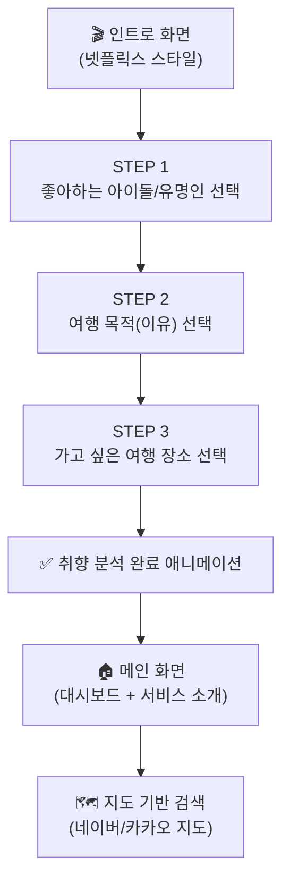

# K-Ride 2.0 — 현재 상황 분석 & 신규 기획의도 반영

> **분석일**: 2026-04-28

---

## 📊 현재 프로젝트 상황 종합

### 1. 데이터 수집 & 전처리 — ✅ 대부분 완료

| 영역              | 데이터                  |  | 건수                  | DB 적재 |              상태              |
| ----------------- | ----------------------- | - | --------------------- | :-----: | :-----------------------------: |
| 🍽️ 맛집 POI     | 소상공인 상가 ZIP       |  | **803,096건**   |   ✅   | 모범 17,905 / 관광 107건 플래그 |
| 🍽️ TourAPI 음식 | contentTypeId=39        |  | **10,535건**    |   ✅   |   17개 시도, 한식/카페/서양식   |
| 🎤 K-Culture      | TourAPI 촬영지          |  | **1,073건**     |   ✅   |   관광지 62 + 여행코스 1,065   |
| 🏛️ 관광 POI     | TourAPI                 |  | **15,905건**    |   ✅   |         전국 17개 시도         |
| 🏛️ 문화시설     | 박물관/한옥/테마파크 등 |  | **18,252건**    |   ✅   |    Vworld/JUSO 지오코딩 완료    |
| 🚲 자전거도로     | data.go.kr              |  | **20,262건**    |   ✅   |            16개 시도            |
| 🚲 자전거보관소   | 공공데이터              |  | **18,277건**    |   ✅   |      WGS84 좌표 직접 사용      |
| ⚠️ 사고다발지   | bicycle + pedestrian    |  | **381건**       |   ✅   |           전국 시군구           |
| 🌤️ 날씨 ASOS    | 전국 67개 관측소        |  | **73,426건**    |   ✅   |        3년치 (2023-2025)        |
| **합계**    | —                      |  | **~960,000건+** |   ✅   |      로컬 PG16 (port 5434)      |

> [!NOTE]
> DB는 Neon(512MB 한계) → **로컬 PostgreSQL 16 + PostGIS**로 전환 완료

### 2. ML/DL 모델 — 6종 학습 완료

| # | 모델                 | 성능                               | 범위        | 비고                             |
| - | -------------------- | ---------------------------------- | ----------- | -------------------------------- |
| 1 | WeatherLSTM          | Acc=**82.16%**, F1=0.72      | ✅ 전국     | 시각화 완료                      |
| 2 | 안전 RF 회귀         | R²=**0.9995**               | ✅ 전국     | leakage 존재하나 API 서비스 가능 |
| 3 | 안전 RF 분류         | F1=**0.9987**                | ✅ 전국     | 동일                             |
| 4 | ConsumeTabNet v3     | MAE=₩42,764, R²=**0.5939** | ✅ 전국     | 국민여행조사 25,893행            |
| 5 | POI Co-occurrence v2 | Recall@5=0.1342                    | ⚠️ 수도권 | AI Hub 한정                      |
| 6 | POI 매력도 TabNet    | R²=0.0662                         | ⚠️ 수도권 | AI Hub 한정                      |

### 3. 미완료 항목

| 영역                 | 항목                                    | 상태                    |
| -------------------- | --------------------------------------- | ----------------------- |
| 데이터               | 둘레길 데이터 (두루누비)                | ⏳ 미수집               |
| 데이터               | K-Culture 크롤링 보완 (나무위키/팬위키) | ✅ (완료) (K_Drama_Unique_Spots 반영) |
| 데이터               | 프리미엄 맛집 (또간집/블루리본)         | 🔜 보류 (API 권한 문제) |
| 백엔드               | FastAPI 엔드포인트 재설계               | ⏳ 필요                 |
| 백엔드               | Ollama LLM 연동                         | ✅ (완료)               |
| 백엔드               | RAG 파이프라인 (ChromaDB)               | ✅ (완료) (test_rag_pipeline 구현) |
| **프론트엔드** | **K-Ride PWA 온보딩 + 지도 + 일정 화면** | ✅ **(완료 — 2026-05-06)**   |

---

## 🎬 신규 기획의도 — 넷플릭스 스타일 온보딩 + 메인 대시보드 + 지도 연동

### 화면 흐름 설계



---

### STEP 1: 좋아하는 아이돌/유명인 선택 (넷플릭스 영화 고르기 느낌)

넷플릭스에서 가입 후 좋아하는 영화/장르를 골라 취향을 파악하듯이, **국내 TOP 50 엔터테인먼트 그룹/솔로**를 카드 형태로 보여주고 선택하게 합니다.

| 구분           | 포함 대상 (예시)                                                                                                                                                                                      |
| -------------- | ----------------------------------------------------------------------------------------------------------------------------------------------------------------------------------------------------- |
| 🎤 K-Pop 그룹  | BTS, BLACKPINK, Stray Kids, SEVENTEEN, aespa, NewJeans, (G)I-DLE, TWICE, EXO, TXT, ENHYPEN, LE SSERAFIM, ATEEZ, NCT, ITZY, IVE, NMIXX, Red Velvet, TREASURE, MONSTA X, GOT7, SHINee, 2NE1, BIGBANG 등 |
| 🎤 K-Pop 솔로  | IU(아이유), 태양, 지코, DEAN, 화사, 선미, 청하, BIBI, 로제, 제니, 지수, 리사 등                                                                                                                       |
| 🎬 배우/드라마 | 이민호, 송혜교, 박서준, 전지현, 김수현, 변우석, 한소희, 송강 등                                                                                                                                       |
| 🎞️ 콘텐츠    | 오징어게임, 더글로리, 이상한변호사우영우, 눈물의여왕, 도깨비 등                                                                                                                                       |

> [!TIP]
> 카드는 넷플릭스처럼 포스터/프로필 이미지 + 이름으로 구성. 터치하면 선택 표시(✓). 다중 선택 가능. 스크롤 또는 슬라이드 형태.

---

### STEP 2: 여행 목적(Trip Reason) 선택

| 이유               | 아이콘 | 설명                        |
| ------------------ | :----: | --------------------------- |
| 🧡**추억**   |   📸   | 특별한 기억을 만들고 싶어요 |
| 💰**가성비** |   💵   | 적은 비용으로 알차게!       |
| 🧘**힐링**   |   🍃   | 일상에서 벗어나 쉬고 싶어요 |
| 🍜**맛집**   |  🍽️  | 맛있는 음식이 최우선!       |

> 다중 선택 가능, 넷플릭스 장르 선택처럼 큰 카드 형태

---

### STEP 3: 가고 싶은 여행 장소 선택

| 지역 | 포함 영역                 |
| ---- | ------------------------- |
| 서울 | 서울특별시                |
| 경기 | 경기도                    |
| 인천 | 인천광역시                |
| 강원 | 강원특별자치도            |
| 경북 | 경상북도                  |
| 경남 | 경상남도                  |
| 전북 | 전라북도 (전북특별자치도) |
| 전남 | 전라남도                  |
| 제주 | 제주특별자치도            |

> [!IMPORTANT]
> 현재 DB에 전국 17개 시도 데이터가 모두 있으므로, 충청/대전/대구/부산/울산/광주/세종 등도 향후 확장 가능. 1차에는 사용자가 지정한 9개 지역으로 진행.

---

### 메인 화면 (온보딩 후 진입)

```
┌─────────────────────────────────────────────────────────┐
│  🇰🇷 K-Ride 2.0  "한국을 발견하다"   [한/EN]  [👤 프로필]  │
├─────────────────────────────────────────────────────────┤
│                                                         │
│  ★ 서비스 소개 히어로 섹션                                │
│  "AI가 만드는 나만의 한국 여행 코스"                       │
│  [지금 시작하기]                                         │
│                                                         │
├─────────────────────────────────────────────────────────┤
│                                                         │
│  ✨ 우리 서비스만의 차별성                                 │
│  ┌──────┐ ┌──────┐ ┌──────┐ ┌──────┐                    │
│  │K-Pop │ │AI코스│ │소비  │ │다국어│                    │
│  │성지  │ │생성  │ │예측  │ │지원  │                    │
│  └──────┘ └──────┘ └──────┘ └──────┘                    │
│                                                         │
├─────────────────────────────────────────────────────────┤
│                                                         │
│  📍 당신을 위한 맞춤 추천 (온보딩 취향 반영)               │
│  [맛집 추천 카드] [K-Culture 추천 카드] [힐링 코스 카드]   │
│                                                         │
├─────────────────────────────────────────────────────────┤
│                                                         │
│  🗺️ 지도로 탐색하기                                     │
│  ┌──────────────────────────────────────┐               │
│  │          네이버/카카오 지도            │               │
│  │    POI 마커 + 경로 + 필터 패널        │               │
│  └──────────────────────────────────────┘               │
│                                                         │
├─────────────────────────────────────────────────────────┤
│  💬 AI 여행 비서 챗봇 (플로팅 버튼)                       │
└─────────────────────────────────────────────────────────┘
```

### 차별성 포인트 (기존 서비스 대비)

| 기존 서비스     | 한계                          | **K-Ride 2.0 차별화**                               |
| --------------- | ----------------------------- | --------------------------------------------------------- |
| VisitKorea      | 일반 관광 정보, 개인화 부족   | **AI 기반 취향 맞춤 추천 + K-Pop 성지순례**         |
| Trazy/Klook     | 예약 중심, K-Pop 연계 없음    | **촬영지·팬덤 성지 + 맛집 통합 코스**              |
| K-Pop Map       | 제한된 데이터, 비용 예측 없음 | **96만건 DB + 소비 예측(R²=0.59) + LLM 코스 생성** |
| 야놀자/여기어때 | 숙박 중심, 경로 설계 안 함    | **당일~3박4일 맞춤 경로 + 지도 시각화**             |

---

### 지도 연동 계획 — 네이버 지도 or 카카오 지도

> [!IMPORTANT]
> 기존 여행지 추천 검색 로직을 네이버/카카오 지도에 붙이는 작업이 핵심

| 항목                        | 네이버 지도           | 카카오 지도             |
| --------------------------- | --------------------- | ----------------------- |
| JavaScript API              | ✅`naver.maps`      | ✅`kakao.maps`        |
| 무료 쿼터                   | 월 3만건              | 월 30만건               |
| 마커/클러스터               | ✅ 지원               | ✅ 지원                 |
| 경로 표시                   | Polyline              | Polyline                |
| 길찾기 API                  | Directions API (유료) | 자체 미제공 (Tmap 연동) |
| **한국 내 지도 품질** | ★★★★★            | ★★★★☆              |
| **외국인 친화**       | ★★★☆☆            | ★★☆☆☆              |

> [!TIP]
> **추천**: 국내 사용자 위주라면 **네이버 지도** (국내 최고 품질), 외국인 포함이면 **Leaflet + OpenStreetMap** 또는 **네이버 지도 + 영문 오버레이** 조합

### 지도에 붙일 기존 로직

```
[검색 로직]
  1. 카테고리 필터 (맛집/K-Culture/관광/둘레길) → DB category 필드
  2. 지역 필터 (시도/시군구) → DB sido/sigungu 필드
  3. 반경 검색 → PostGIS ST_DWithin 쿼리
  4. 안전 점수 오버레이 → safety_regressor.pkl 예측값
  5. 날씨 정보 → WeatherLSTM 예보 + KMA API
  6. 소비 예측 → ConsumeTabNet v3 (일정/인원/지역 입력)

[지도 표시]
  - POI 마커: 카테고리별 아이콘 (🍽️🎤🏛️🌿🚲)
  - 경로: Polyline으로 코스 연결
  - 클러스터링: 줌 레벨에 따라 마커 그룹핑
  - 사이드 패널: 선택 POI 상세 정보
```

---

## 📋 프론트엔드 개발 로드맵

| 단계              | 작업                                 | 기술                             | 예상 소요 | 상태 |
| ----------------- | ------------------------------------ | -------------------------------- | --------- | ---- |
| **Phase 1** | 넷플릭스 스타일 인트로/온보딩        | Next.js 14 + SDUI DynamicEngine  | 3일       | ✅ **완료 (2026-05-06)** |
| **Phase 2** | 메인 대시보드 (서비스 소개 + 차별성) | 동일                             | 2일       | ✅ **완료 (my-list 요약 화면으로 구현)** |
| **Phase 3** | 지도 연동 + POI 마커                 | Leaflet + OpenStreetMap          | 3일       | ✅ **완료 (focus 페이지 MapView 컴포넌트)** |
| **Phase 4** | 검색/필터 기능 + FastAPI 연결        | REST API 통신                    | 2일       | ⏳ K-Ride FastAPI 연동 대기 |
| **Phase 5** | AI 챗봇 패널 + LLM 연동              | WebSocket or REST                | 2일       | ⏳ 미착수 |

---

## ⚡ 즉시 시작 가능한 작업

> [!CAUTION]
> 프론트엔드가 **전체 미착수** 상태이므로, 인트로 + 메인 화면 구현이 가장 시급합니다.

1. ~~**넷플릭스 스타일 온보딩 화면** — 순수 HTML/CSS/JS로 프로토타입~~ ✅ 완료 (Next.js + SDUI DynamicEngine)
2. ~~**메인 대시보드** — 서비스 소개 + 차별성 섹션~~ ✅ 완료 (my-list 요약 화면)
3. ~~**지도 연동**~~ ✅ 완료 (Leaflet + OpenStreetMap, focus 페이지)
4. **K-Ride FastAPI 엔드포인트 연결** → `/poi/search`, `/recommend` 실제 데이터 연동
5. **아티스트/지역 실제 이미지 교체** → Supabase Storage 업로드 후 URL 반영
6. **SDUI DB V40 migration 적용** → `./gradlew bootRun` 후 Flyway 자동 실행

---

## ✅ Phase 1 완료 요약 (2026-05-06)

### 구현된 파일 목록 (`d:/kride-project/netflix-clone-main/`)

| 파일 | 역할 |
|------|------|
| `src/components/dynamic-engine/type.ts` | Metadata, DynamicEngineProps 인터페이스 |
| `src/components/dynamic-engine/DynamicEngine.tsx` | SDUI 재귀 렌더러 (K-Ride 적용) |
| `src/components/dynamic-engine/useDynamicEngine.ts` | 데이터 바인딩 (formData > rowData > pageData) |
| `src/components/dynamic-engine/componentMap.ts` | Level 1~3 전체 컴포넌트 등록 |
| `src/components/dynamic-engine/screenMap.ts` | KRIDE_INTRO1 ~ KRIDE_FOCUS |
| `src/components/dynamic-engine/hooks/useBaseActions.ts` | 폼 상태 관리 |
| `src/components/dynamic-engine/hooks/useBusinessActions.ts` | K-Ride 액션 6종 (SET_DURATION 등) |
| `src/components/dynamic-engine/hooks/usePageHook.ts` | 액션 라우터 |
| `src/store/onboarding-store.ts` | Zustand persist (localStorage 동기화) |
| `src/components/kride/atoms/CardImage.tsx` | Level 2 Atom — 원형/사각 이미지 |
| `src/components/kride/atoms/CardLabel.tsx` | Level 2 Atom — 카드 라벨 |
| `src/components/kride/atoms/CheckIndicator.tsx` | Level 2 Atom — 선택 체크 오버레이 |
| `src/components/kride/atoms/RangeInput.tsx` | Level 2 Atom — range input |
| `src/components/kride/atoms/RangeTrack.tsx` | Level 2 Atom — 빨간 슬라이더 트랙 |
| `src/components/kride/atoms/RangeLabel.tsx` | Level 2 Atom — ₩ 금액 표시 |
| `src/components/kride/atoms/CollapseHeader.tsx` | Level 2 Atom — 아코디언 헤더 |
| `src/components/kride/atoms/CollapseBody.tsx` | Level 2 Atom — 아코디언 본문 |
| `src/components/kride/atoms/RouteNode.tsx` | Level 2 Atom — 경로 노드 |
| `src/components/kride/atoms/PurposeIcon.tsx` | Level 2 Atom — 여행목적 아이콘 |
| `src/components/kride/atoms/DurationLabel.tsx` | Level 2 Atom — 버튼 텍스트 |
| `src/components/kride/SelectionCard.tsx` | Level 3 복합 — 아티스트/지역 선택 카드 |
| `src/components/kride/DurationButton.tsx` | Level 3 복합 — 여행기간 버튼 |
| `src/components/kride/PurposeCard.tsx` | Level 3 복합 — 여행목적 카드 |
| `src/components/kride/DualRangeSlider.tsx` | Level 3 복합 — 예산 듀얼 슬라이더 |
| `src/components/kride/MapView.tsx` | Level 3 복합 — Leaflet 지도 (SSR 비활성) |
| `src/components/kride/ItineraryPanel.tsx` | Level 3 복합 — 아코디언 일정 패널 |
| `src/app/(afterLogin)/_component/conditional-header.tsx` | 온보딩 화면에서 헤더 숨김 |
| `src/app/(afterLogin)/layout.tsx` | ConditionalHeader 적용 |
| `src/app/(afterLogin)/browse/page.tsx` | Intro1 — 여행기간 선택 |
| `src/app/(afterLogin)/movies/page.tsx` | Intro2 — 아티스트 20명 선택 |
| `src/app/(afterLogin)/latest/page.tsx` | Intro3 — 지역 10개 선택 |
| `src/app/(afterLogin)/intro4/page.tsx` | Intro4 — 여행목적 6개 카드 |
| `src/app/(afterLogin)/intro5/page.tsx` | Intro5 — 예산 듀얼 슬라이더 |
| `src/app/(afterLogin)/my-list/page.tsx` | 온보딩 요약 + AI 추천 배너 |
| `src/app/(afterLogin)/focus/page.tsx` | 지도 60% + 일정 아코디언 40% |
| `src/middleware.ts` | broken URL 수정 + K-Ride 경로 보호 |
| `next.config.js` | Supabase 도메인 추가, PWA 주석 준비 |
| `public/manifest.json` | PWA 매니페스트 |
| `SDUI/SDUI-server/.../V40__kride_screens.sql` | SDUI DB K-Ride 화면 정의 |

### 남은 작업 (다음 세션)
- [ ] `npm install zustand react-leaflet@4 leaflet @types/leaflet` 실행 확인
- [ ] Leaflet 아이콘 파일 `public/leaflet/` 복사
- [ ] K-Ride FastAPI 실제 데이터 연동 (`/api/artists`, `/api/regions`)
- [ ] 아티스트/지역 실제 이미지 Supabase Storage 업로드
- [ ] `npm run test` Jest 각 화면 단위 테스트 작성
- [ ] SDUI V40 migration 적용 및 SDUI 서버 연동 테스트

---

> **요약**: 데이터(96만건)와 모델(6종) 준비 완료. 프론트엔드 Phase 1~3(온보딩 5단계 + 요약 + 지도+일정) 구현 완료. **다음 단계는 K-Ride FastAPI 실제 데이터 연동 및 테스트.**
