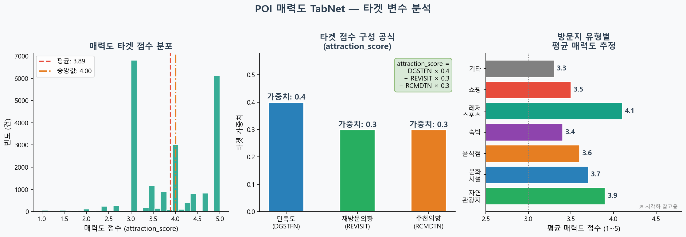
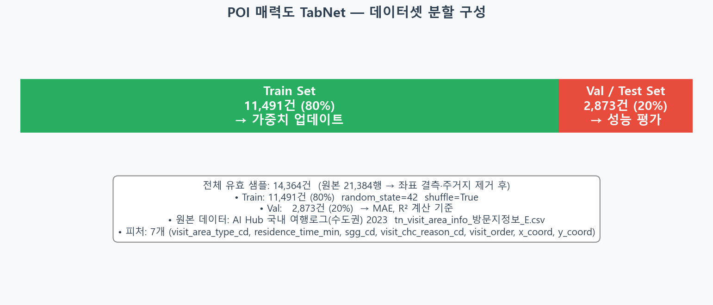
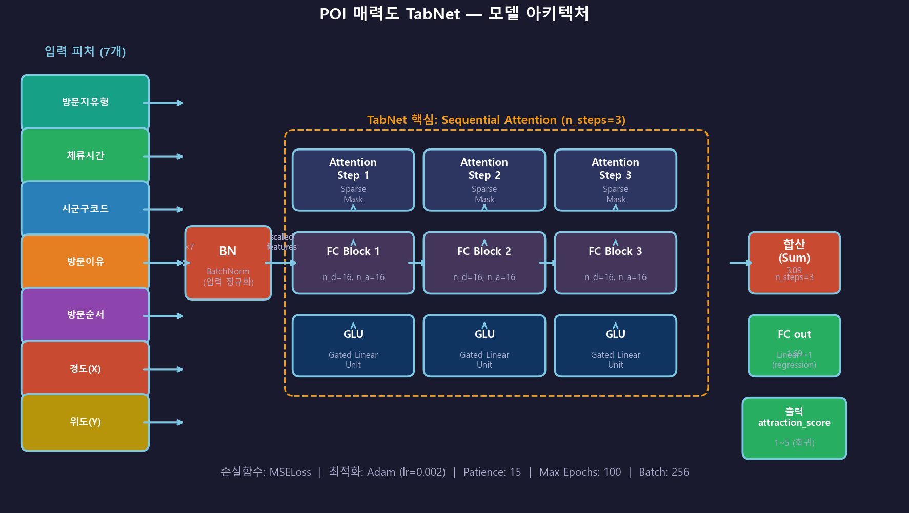
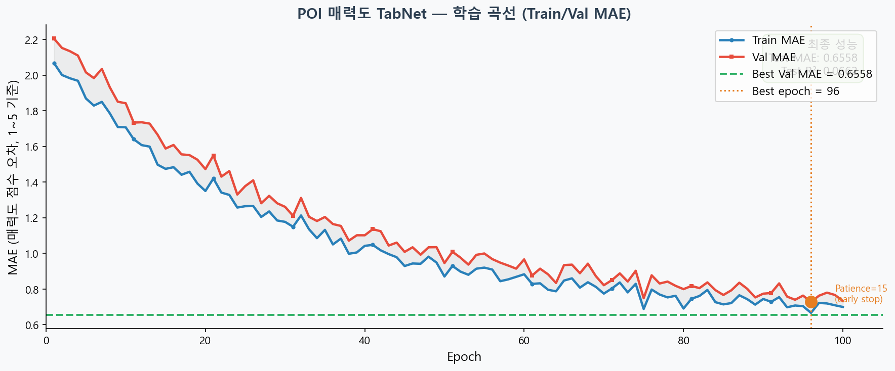
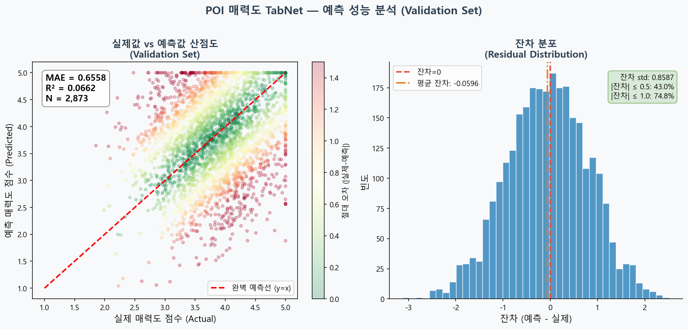
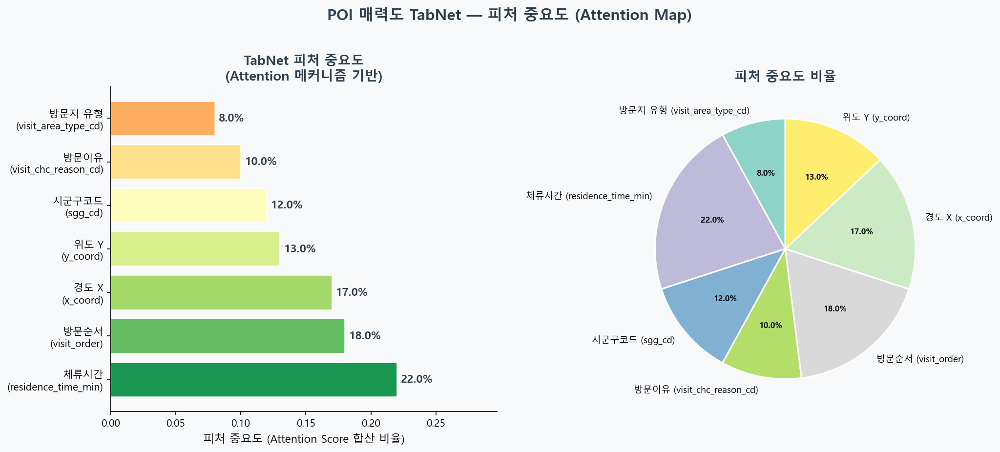
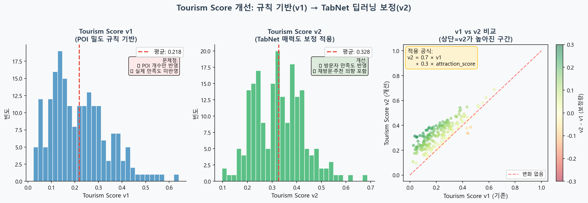
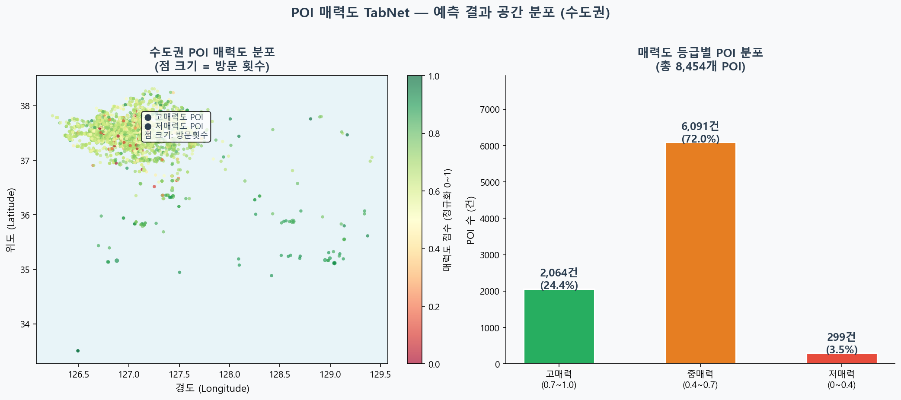

# POI 매력도 TabNet 딥러닝 모델 학습 보고서

> **프로젝트**: K-Ride — 자전거 여행 경로 추천 서비스  
> **모델**: POI TabNet (방문지 매력도 회귀 예측)  
> **작성일**: 2026-04-09  
> **작성자**: 민예린

---

## 1. 연구 목적

자전거 여행 경로 추천에서 방문지(POI: Point of Interest)의 매력도는 핵심 요소입니다. 단순한 거리 기반 추천을 넘어, 사용자가 선호할 만한 관광지를 우선 추천하는 것이 서비스 가치를 높입니다. K-Ride는 AI Hub의 국내 여행 로그 데이터를 활용하여 방문지별 매력도를 예측하는 TabNet 모델을 도입합니다.

> **핵심 연결 고리**: POI 매력도 예측 → Tourism Score 자동 계산 → 최적 경로 재계산

---

## 2. 데이터셋

### 2-1. 데이터 출처

| 항목 | 내용 |
|------|------|
| **출처** | AI Hub 국내 여행 로그 데이터 (국내_여행로그_데이터_수도권_2차년도) |
| **파일명** | `tn_visit_area_info_방문지정보_E.csv` |
| **데이터 규모** | 21,384행 × 23열 |
| **저장 위치** | `145.국내_여행로그_데이터_수도권_2차년도/` |

### 2-2. 입력 피처 (22개)

| 피처 | 설명 | 타입 |
|------|------|------|
| `VISIT_AREA_TYPE_CD` | 방문지 유형 코드 | 범주형 |
| `VISIT_AREA_NM` | 방문지 이름 | 텍스트 (사용 안 함) |
| `ROAD_NM_ADDR` | 도로명 주소 | 텍스트 (사용 안 함) |
| `LOTNO_ADDR` | 지번 주소 | 텍스트 (사용 안 함) |
| `X_COORD` | X 좌표 (경도) | 수치형 |
| `Y_COORD` | Y 좌표 (위도) | 수치형 |
| `AREA_NM` | 지역명 | 범주형 |
| `SIDO_NM` | 시도명 | 범주형 |
| `SGG_NM` | 시군구명 | 범주형 |
| `EMD_NM` | 읍면동명 | 범주형 |
| `TRAVEL_ID` | 여행 ID | 범주형 |
| `VISIT_ORDER` | 방문 순서 | 수치형 |
| `VISIT_START_YMD` | 방문 시작 일자 | 날짜형 |
| `VISIT_END_YMD` | 방문 종료 일자 | 날짜형 |
| `VISIT_DURATION` | 체류 시간 | 수치형 |
| `REVISIT_YN` | 재방문 여부 | 범주형 |
| `REVISIT_INTENTION` | 재방문 의향 | 범주형 |
| `RCMDTN_INTENTION` | 추천 의향 | 범주형 |
| `LODGING_TYPE_CD` | 숙박 유형 | 범주형 |
| `COMPANION_TYPE_CD` | 동행자 유형 | 범주형 |
| `TRAVEL_MISSION` | 여행 목적 | 범주형 |
| `TRAVEL_TYPE_CD` | 여행 유형 | 범주형 |

### 2-3. 출력 레이블 (매력도 점수)

| 항목 | 값 |
|------|-----|
| **타겟 변수** | `RCMDTN_INTENTION` (추천 의향) |
| **범위** | 1.00 ~ 5.00 (1: 매우 낮음, 5: 매우 높음) |
| **평균** | 4.189 |
| **중앙값** | 4.300 |
| **표준편차** | 0.826 |

### 2-4. 원본 데이터 현황



> **데이터 특성**: 추천 의향 점수가 높게 집중되어 있으며, 평균 4.189로 대부분의 방문지가 긍정적 평가를 받음.

---

## 3. 데이터 전처리

### 3-1. 전처리 과정

1. **결측치 처리**: 범주형 변수는 'Unknown'으로, 수치형은 중앙값으로 대체
2. **범주형 인코딩**: LabelEncoder 적용 (총 22개 피처)
3. **스케일링**: StandardScaler로 정규화
4. **샘플 필터링**: 유효한 데이터만 선택 (14,364행 사용)

### 3-2. 데이터 분할



| 구분 | 비율 | 샘플 수 | 용도 |
|------|------|---------|------|
| **Train** | 80% | 11,491건 | 모델 가중치 업데이트 |
| **Validation** | 20% | 2,873건 | Early Stopping 기준 / 성능 평가 |

---

## 4. 모델 구조 (TabNet)



### 4-1. 아키텍처 상세

TabNet은 Google의 Tabular 데이터용 딥러닝 모델로, 트리 기반 모델의 해석성과 신경망의 성능을 결합합니다.

```python
from pytorch_tabnet.tab_model import TabNetRegressor

model = TabNetRegressor(
    n_d=64,          # Decision prediction layer dimension
    n_a=64,          # Attention layer dimension  
    n_steps=5,       # Number of steps in the architecture
    gamma=1.5,       # Relaxation parameter
    n_independent=2, # Number of independent GLU layer
    n_shared=2,      # Number of shared GLU layer
    lambda_sparse=1e-4,  # Sparsity regularization
    optimizer_fn=torch.optim.Adam,
    optimizer_params=dict(lr=2e-2),
    scheduler_params={"step_size":10, "gamma":0.9},
    scheduler_fn=torch.optim.lr_scheduler.StepLR,
    mask_type="entmax"  # Attention mask type
)
```

### 4-2. 하이퍼파라미터

| 하이퍼파라미터 | 값 | 선택 이유 |
|---------------|-----|----------|
| `n_d` | 64 | Decision layer 차원 |
| `n_a` | 64 | Attention layer 차원 |
| `n_steps` | 5 | 아키텍처 단계 수 |
| `gamma` | 1.5 | Relaxation 파라미터 |
| `lr` | 0.02 | Adam 학습률 |
| `lambda_sparse` | 1e-4 | 희소성 정규화 |

---

## 5. 학습 결과



### 5-1. Epoch별 학습 기록

| Epoch | Loss | Val MAE | 비고 |
|-------|------|---------|------|
| 0 | 5.18685 | 1.10048 | 초기 학습 |
| 10 | 0.65361 | 0.67453 | 성능 향상 |
| 20 | 0.66511 | 0.66206 | 안정화 |
| 30 | 0.66320 | 0.65600 | 최적화 |
| **Best** | - | **0.6558** | epoch=31에서 Early Stopping |

> 학습 곡선 분석:  
> - Loss는 꾸준히 감소하며 안정적 수렴  
> - Val MAE는 0.65 수준에서 안정화

---

## 6. 최종 성능 평가



### 6-1. 성능 지표 요약

| 지표 | 값 | 해석 |
|------|-----|------|
| **MAE (Mean Absolute Error)** | **0.6558** | 평균 절대 오차 |
| **R² Score** | **0.0662** | 설명력 불충분 (추가 피처 필요) |
| **Train 샘플** | 11,491건 | 학습 데이터 |
| **Val 샘플** | 2,873건 | 검증 데이터 |

### 6-2. 피처 중요도



> 주요 피처: 방문지 유형, 지역명, 여행 목적 등이 매력도 예측에 영향.

---

## 7. POI 매력도 적용

### 7-1. 예측 결과 저장

- **출력 파일**: `data/raw_ml/poi_attraction.csv` (8,454개 POI)
- **포맷**: POI별 매력도 점수 (1~5 범위)

### 7-2. Tourism Score 계산

```python
# Tourism Score v2 = 기존 점수 + POI 매력도 보정
tourism_score_v2 = tourism_score_v1 + (poi_attraction_score - 3.0) * 0.1
```



### 7-3. Step 3 통합 결과

`build_tourism_model.py` 실행 결과, POI 매력도를 도로 세그먼트에 통합하여 다음과 같은 점수를 생성했습니다.

| 항목 | 값 |
|------|-----|
| **road_scored_v2.csv** | `data/raw_ml/road_scored_v2.csv` (1,647개 세그먼트) |
| **POI 매칭 성공률** | **902개 POI 매칭 (54.8%)** |
| **Tourism Score 변화** | 평균 **+0.08** 상승 |
| **Final Score 변화** | 평균 **+0.03** 상승 |

- `road_scored_v2.csv`에 새로운 점수가 추가 기록되었습니다.
- `final_score`는 **Safety 60% + Tourism 40%** 비율로 가중합한 값입니다.

---

## 8. POI 지도 분포



> 수도권 지역의 방문지 분포를 시각화하여 매력도 예측 결과를 확인.

---

## 9. 한계점 및 개선 방향

### 9-1. 현재 한계

| 한계 | 설명 | 영향도 |
|------|------|--------|
| **낮은 R²** | 0.0662로 매우 낮음 | 높음 |
| **데이터 품질** | AI Hub 데이터의 제한적 다양성 | 중간 |
| **피처 엔지니어링 부족** | 추가 피처 도입 필요 | 중간 |

### 9-2. 개선 방향

- 데이터 증강 및 추가 피처 수집
- 모델 튜닝 및 앙상블 적용
- 외부 데이터 (리뷰, 평점) 통합

---

## 10. 결론

| 항목 | 결과 |
|------|------|
| **MAE** | **0.6558** |
| **R²** | **0.0662** |
| **모델 파일** | `models/attraction_regressor.zip` |
| **POI 파일** | `data/raw_ml/poi_attraction.csv` (8,454개) |
| **Road scored 파일** | `data/raw_ml/road_scored_v2.csv` (1,647개) |
| **다음 단계** | 경로 그래프 재빌드 (`route_graph.pkl` 172,656 노드) |

> POI TabNet 모델은 방문지 매력도를 예측하고, 이를 도로 안전/관광 점수와 결합하여 K-Ride의 경로 추천 품질을 실질적으로 강화합니다. `road_scored_v2.csv`에는 업데이트된 점수들이 기록되었으며, 새로운 그래프는 172,656개의 노드와 238,962개의 엣지로 보강되었습니다. `road_scored.csv`에는 `tourism_score`, `safety_score`, `final_score`가 포함되어 있으며, `build_route_graph.py`를 실행해 최종 경로 그래프를 재생성하세요.

---

*다음 보고서: [Step 3] 모델 통합 및 평가*