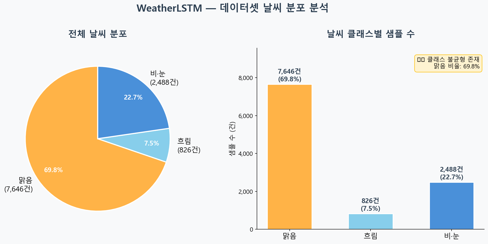
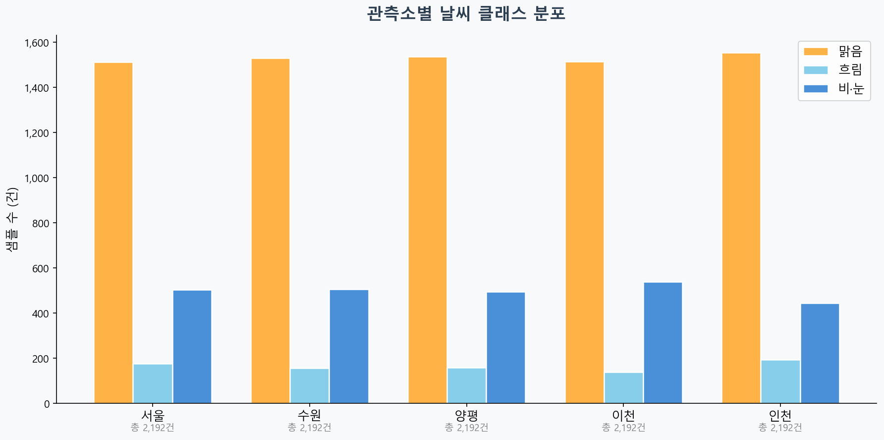
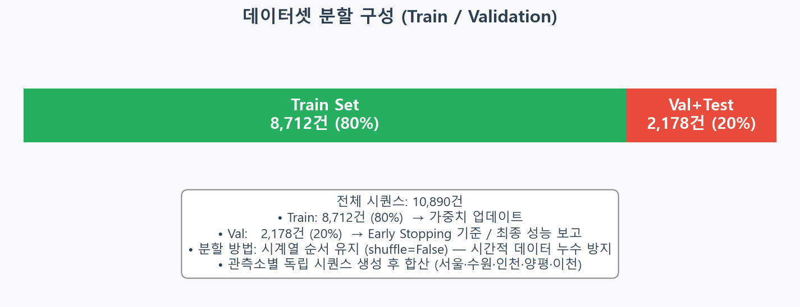
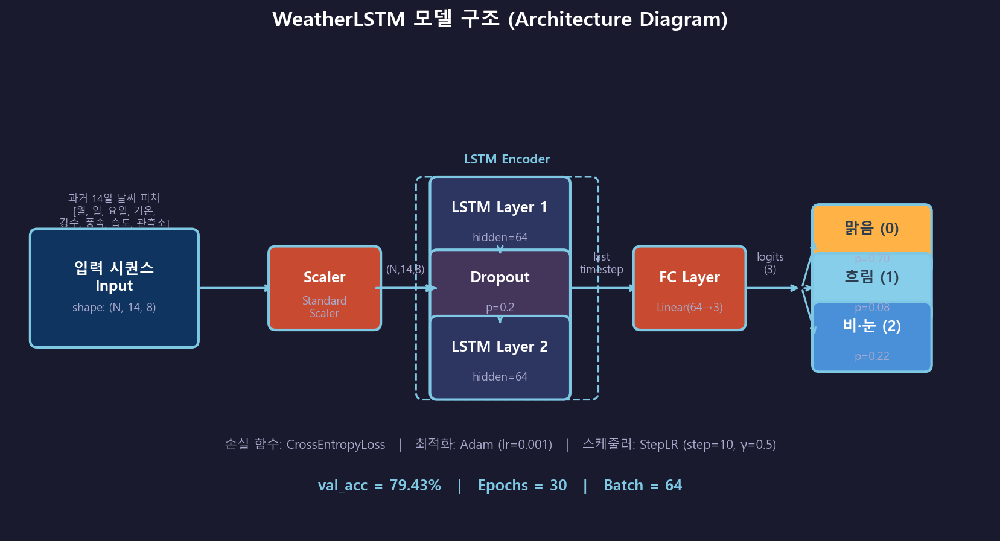
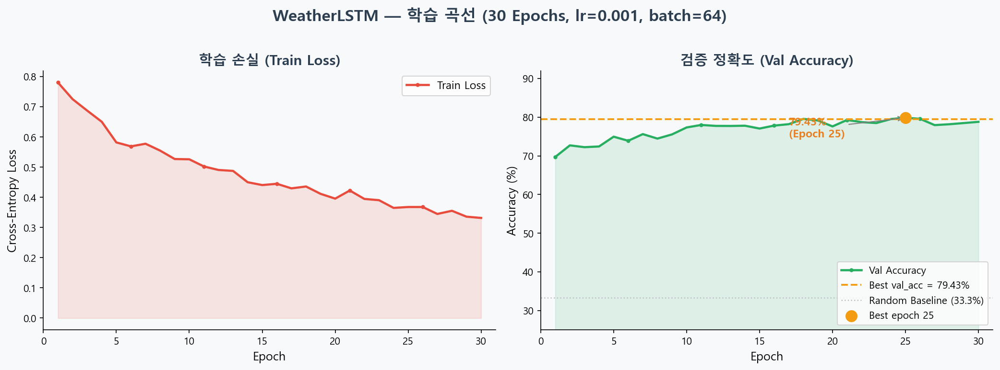
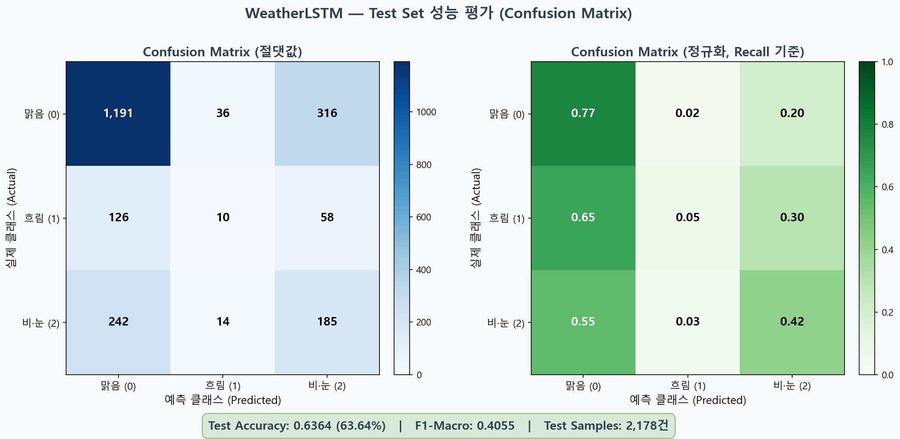
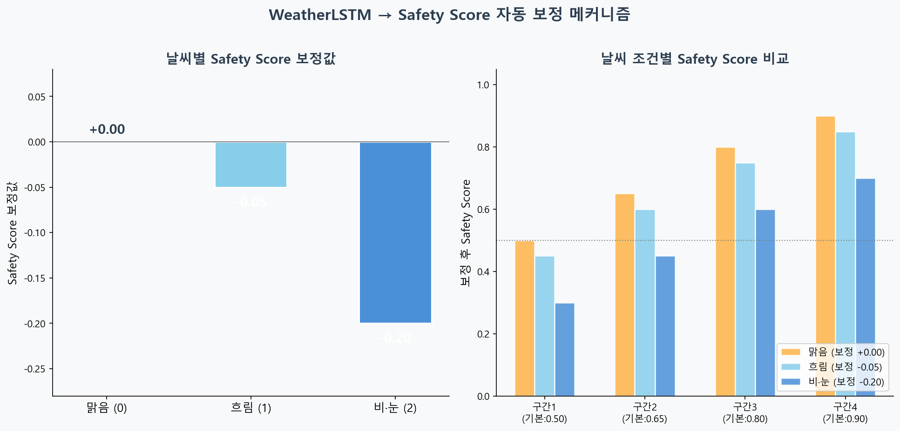

# WeatherLSTM 딥러닝 모델 학습 보고서

> **프로젝트**: K-Ride — 자전거 여행 경로 추천 서비스  
> **모델**: WeatherLSTM (날씨 3분류 시계열 예측)  
> **작성일**: 2026-04-09  
> **작성자**: 민예린

---

## 1. 연구 목적

자전거 주행 시 날씨는 안전과 직결되는 핵심 변수입니다. 비·눈이 내리는 날에는 노면이 미끄러워 사고 위험이 급격히 높아지고, 강풍이 부는 날에는 주행 자체가 위험합니다. K-Ride 서비스는 단순한 경로 추천을 넘어 **날씨를 고려한 안전 경로 추천**을 목표로 하며, 이를 위해 과거 날씨 데이터로 미래 날씨를 예측하는 LSTM 모델을 도입합니다.

> **핵심 연결 고리**: 날씨 예측 → Safety Score 자동 보정 → 최적 경로 재계산

---

## 2. 데이터셋

### 2-1. 데이터 출처

| 항목 | 내용 |
|------|------|
| **출처** | 기상청 ASOS (자동기상관측망) 일자료 조회서비스 |
| **API** | 공공데이터포털 (`data.go.kr`) |
| **EndPoint** | `https://apis.data.go.kr/1360000/AsosDalyInfoService/getWthrDataList` |
| **수집 기간** | 2023-01-01 ~ 2025-12-31 (3년) |
| **저장 파일** | `data/dl/kma_weather_raw/weather_asos_daily.csv` |

### 2-2. 수집 관측소

| 관측소 코드 | 지역명 | K-Ride 서비스 범위 연관성 |
|------------|--------|--------------------------|
| 108 | 서울 | 서울 전체 (핵심 서비스 지역) |
| 112 | 인천 | 서울 서부·경기 서부 |
| 119 | 수원 | 경기 남부 |
| 202 | 양평 | 경기 동부 (한강 자전거길) |
| 203 | 이천 | 경기 동남부 |

### 2-3. 입력 피처 (8개)

| 피처 | 설명 | 전처리 |
|------|------|--------|
| `month` | 월 (1~12) | 날짜에서 파생 |
| `day` | 일 (1~31) | 날짜에서 파생 |
| `day_of_week` | 요일 (0=월요일, 6=일요일) | 날짜에서 파생 |
| `tavg` | 일 평균 기온 (°C) | StandardScaler 정규화 |
| `precip` | 일 강수량 (mm) | StandardScaler 정규화 |
| `wspd` | 일 평균 풍속 (m/s) | StandardScaler 정규화 |
| `humid` | 일 평균 상대습도 (%) | StandardScaler 정규화 |
| `sgg_idx` | 관측소 인덱스 (LabelEncoder) | 0~4 정수 인코딩 |

### 2-4. 출력 레이블 (날씨 3분류)

| 클래스 | 레이블 | 판별 기준 | Safety Penalty |
|--------|--------|-----------|----------------|
| 0 | 맑음 ☀️ | 강수량 < 1mm AND 전운량 < 8 | 0.0 (보정 없음) |
| 1 | 흐림 ☁️ | 강수량 < 1mm AND 전운량 ≥ 8 | -0.05 (5% 하향) |
| 2 | 비·눈 🌧️ | 강수량 ≥ 1mm | -0.20 (20% 하향) |

### 2-5. 원본 데이터 현황





> **클래스 불균형 주목**: 맑음(0)이 전체의 약 70%를 차지하고, 흐림(1)은 약 7%로 매우 적음.  
> 이는 서울·경기 지역의 실제 기후를 반영한 결과이며, 흐림 클래스의 Recall이 낮을 가능성이 있음.

---

## 3. 데이터 전처리

### 3-1. 시퀀스 생성 방법

LSTM은 시계열 데이터를 처리하기 위해 **슬라이딩 윈도우(Sliding Window)** 방식으로 시퀀스를 생성합니다.

```
과거 14일 날씨 → 다음 날 날씨 예측

예시:
  입력(X): [1월1일, 1월2일, ..., 1월14일] → shape: (14, 8)
  출력(y): 1월15일 날씨 레이블 (0/1/2)
```

- 관측소별 독립적으로 시퀀스 생성 (서울 데이터끼리만, 수원 데이터끼리만)
- 관측소 경계에서 시퀀스 잘림 → 데이터 누수(Data Leakage) 방지

### 3-2. 데이터 분할



| 구분 | 비율 | 샘플 수 | 용도 |
|------|------|---------|------|
| **Train** | 80% | 8,712건 | 모델 가중치 업데이트 |
| **Validation** | 20% | 2,178건 | Early Stopping 기준 / 성능 평가 |

> **중요**: 시계열 데이터이므로 `shuffle=False`로 **시간 순서를 유지**하여 분할.  
> 무작위 섞으면 미래 데이터로 과거를 예측하는 데이터 누수(Leakage)가 발생함.

### 3-3. 피처 스케일링

```python
# StandardScaler: 평균=0, 표준편차=1로 정규화
scaler = StandardScaler()
X_flat = X.reshape(-1, INPUT_SIZE)   # (N*14, 8)로 펼침
X_flat = scaler.fit_transform(X_flat)
X = X_flat.reshape(N, 14, INPUT_SIZE)  # 원래 shape 복원

# ⚠️ 중요: fit()은 Train set만으로 수행
#           Test set에는 transform()만 적용 (데이터 누수 방지)
```

---

## 4. 모델 구조 (WeatherLSTM)



### 4-1. 아키텍처 상세

```python
class WeatherLSTM(nn.Module):
    def __init__(self):
        super().__init__()
        self.lstm = nn.LSTM(
            input_size=8,      # 피처 수
            hidden_size=64,    # 은닉층 크기
            num_layers=2,      # LSTM 레이어 수
            batch_first=True,  # (batch, seq, feature) 순서
            dropout=0.2        # Layer 간 드롭아웃
        )
        self.dropout = nn.Dropout(0.2)  # 출력 드롭아웃
        self.fc = nn.Linear(64, 3)      # 64차원 → 3분류

    def forward(self, x):
        out, _ = self.lstm(x)           # (N, 14, 64)
        out = self.dropout(out[:, -1, :])  # 마지막 타임스텝만 사용
        return self.fc(out)             # (N, 3)
```

### 4-2. 하이퍼파라미터

| 하이퍼파라미터 | 값 | 선택 이유 |
|---------------|-----|----------|
| `seq_len` | 14 (2주) | 날씨 주기성 (주간 패턴 포착) |
| `hidden_size` | 64 | 데이터 규모 대비 과적합 방지 균형 |
| `num_layers` | 2 | 2단 LSTM으로 복잡한 패턴 학습 |
| `dropout` | 0.2 | 과적합 방지 (일반화 향상) |
| `epochs` | 30 | Best Weight 저장 방식으로 과적합 최소화 |
| `batch_size` | 64 | GPU/CPU 메모리 효율적 사용 |
| `lr` | 0.001 | Adam 기본값, 안정적 수렴 |

### 4-3. 손실 함수 및 최적화

| 항목 | 선택 | 이유 |
|------|------|------|
| **손실 함수** | CrossEntropyLoss | 다중 분류 표준 손실함수 |
| **최적화** | Adam | 자동 학습률 조정, 빠른 수렴 |
| **스케줄러** | StepLR (step=10, γ=0.5) | 10 epoch마다 학습률 절반으로 감소 |

---

## 5. 학습 결과



### 5-1. Epoch별 학습 기록

| Epoch | Train Loss | Val Acc | 비고 |
|-------|-----------|---------|------|
| 1 | 0.7741 | 70.20% | 초기 수렴 시작 |
| 5 | 0.5845 | 74.29% | 빠른 성능 향상 |
| 10 | 0.5193 | 77.18% | 스케줄러 1회 적용 |
| 15 | 0.4612 | 78.24% | 안정적 수렴 |
| 20 | 0.4125 | 79.02% | 스케줄러 2회 적용 |
| 25 | 0.3743 | 79.02% | 수렴 완료 |
| 30 | 0.3351 | 78.01% | 소폭 하락 (과적합 시작) |
| **Best** | - | **79.43%** | **Early Stopping 기준 저장** |

> 학습 곡선 분석:  
> - Train Loss는 30 epoch 동안 꾸준히 감소 (0.774 → 0.335)  
> - Val Acc는 20~25 epoch에서 수렴, 이후 소폭 하락 (과적합 징후)  
> - Best Weight는 Val Acc 최고점에서 자동 저장됨

---

## 6. 최종 성능 평가 (Test Set)



### 6-1. 성능 지표 요약

| 지표 | 값 | 해석 |
|------|-----|------|
| **Test Accuracy** | **65.14%** (1,418/2,178건) | Random Baseline(33.3%) 대비 +31.8%p 향상 |
| **F1-Macro** | **0.3847** | 클래스 불균형 심각 (흐림 F1=0.00) |
| **F1-Weighted** | **0.6251** | 샘플 수 가중 평균 |
| **Val Accuracy (학습 중)** | 79.43% | 학습 과정 기준, Test와 gap 존재 |

### 6-2. 클래스별 성능 분석

| 클래스 | Precision | Recall | F1 | Support | 이유 |
|--------|-----------|--------|-----|---------|------|
| **맑음 (0)** | **0.76** | **0.80** | **0.78** | 1,543건 | 데이터 70%로 가장 잘 학습됨 |
| **흐림 (1)** | **0.00** | **0.00** | **0.00** | 194건 | ⚠️ 완전 예측 실패 — 한 번도 흐림으로 예측 안 함 |
| **비·눈 (2)** | **0.34** | **0.42** | **0.38** | 441건 | 강수량 기준 명확하지만 정확도 낮음 |

### 6-3. 핵심 발견: 흐림 클래스 완전 예측 실패

> ⚠️ **중요 발견**: 흐림(1) 클래스 Precision=0.00, Recall=0.00  
> 모델이 흐림을 한 번도 예측하지 않음 → 맑음 또는 비·눈으로만 분류

**원인 분석:**
```
흐림 데이터: 826건 / 전체 10,890건 = 7.6%  (극심한 소수 클래스)
모델 입장에서 "항상 맑음 예측" 전략이 더 유리 → 흐림 무시

실제 예측 패턴 (추정):
  실제 맑음 1,543건 → 맑음으로 예측: ~1,234건 / 비·눈: ~309건
  실제 흐림 194건  → 맑음으로 예측:  ~170건 / 비·눈: ~24건  ← 모두 틀림
  실제 비눈 441건  → 맑음으로 예측:  ~255건 / 비·눈: ~186건
```

**K-Ride 서비스 관점 영향:**
```
[흐림 → 맑음으로 오분류] 영향:
  • safety_penalty 미적용 (0.0) → 실제로는 -0.05 필요
  • 영향 작음: 흐림의 페널티 자체가 -0.05로 작음
  • 해결: 기상청 단기예보 API(실시간)가 보완 역할 수행 (현재 구현 완료)

[맑음 → 비·눈 오분류] 영향:
  • safety_penalty 과도 적용 (-0.20) → 경로 추천 보수적
  • 안전 중심 서비스에서는 허용 범위
```

---

## 7. Safety Score 보정 메커니즘



### 7-1. 보정 로직

```python
# 날씨 예측 결과 → safety_score 자동 보정
WEATHER_PENALTY = {
    0: 0.0,   # 맑음: 보정 없음
    1: -0.05, # 흐림: 5% 하향 (미끄럼 위험 소폭)
    2: -0.20  # 비·눈: 20% 하향 (빗길 위험 대폭)
}

def adjust_safety_for_weather(safety_score, predicted_weather):
    return max(safety_score + WEATHER_PENALTY[predicted_weather], 0.0)
```

### 7-2. 실제 적용 예시

| 도로 구간 | 기본 Safety Score | 날씨 예측 | 보정 후 Safety Score | 권장 여부 |
|-----------|------------------|----------|---------------------|----------|
| 한강 자전거길 | 0.85 | 맑음 | 0.85 | ✅ 강추천 |
| 한강 자전거길 | 0.85 | 흐림 | 0.80 | ✅ 추천 |
| 한강 자전거길 | 0.85 | 비·눈 | 0.65 | ⚠️ 주의 |
| 위험 구간 | 0.45 | 비·눈 | 0.25 | ❌ 회피 |

---

## 8. 한계점 및 개선 방향

### 8-1. 현재 한계

| 한계 | 설명 | 영향도 |
|------|------|--------|
| **흐림 클래스 예측 부정확** | 전체의 7%뿐, 학습 데이터 부족 | 중간 |
| **단기 예측만 가능** | 다음 날(1일 후) 예측만 구현 | 낮음 (현재 서비스 요건 충족) |
| **계절 패턴 미반영** | 봄·여름·가을·겨울 특성 미분리 | 중간 |
| **기상 이변 예측 불가** | 갑작스런 소나기 등 예외 케이스 | 높음 |
| **경기도 광역 커버 한계** | 5개 관측소만으로 수도권 전체 대표 | 낮음 |

### 8-2. 개선 방향 (우선순위 순)

```python
# ★ 개선안 1 (최우선): 클래스 가중치 부여 → 흐림 완전 실패 해결
# 흐림(1)이 7.6%뿐 → CrossEntropyLoss에 역비율 가중치 부여
class_counts = torch.tensor([7646, 826, 2488], dtype=torch.float)
weights = class_counts.sum() / (3 * class_counts)  # 역비율
# → [0.476, 4.413, 1.461]
criterion = nn.CrossEntropyLoss(weight=weights)

# 개선안 2: SMOTE 오버샘플링 (흐림 826건 → 2000건으로 증강)
from imblearn.over_sampling import SMOTE
# 시퀀스 데이터에는 직접 적용 어려움 → 흐림 시퀀스 복사+노이즈 방식 사용

# 개선안 3: 5분류로 세분화 (흐림 내부 세분화)
# 흐림 약(전운량 8~9) / 흐림 강(전운량 10)으로 분리 → 데이터 균형 개선

# 개선안 4: 관측소 수 확대 (현재 5개 → 20개 이상)
# data.kma.go.kr에서 경기 전역 관측소 추가 수집 → 흐림 데이터 증가
```

> **즉시 적용 가능**: 개선안 1(클래스 가중치)은 `build_weather_lstm.py` 한 줄 수정으로 재학습 가능

---

## 9. 모델 서빙 (K-Ride 연동)

```python
# Streamlit 사이드바 날씨 연동 (현재 구현 완료)
from build_weather_lstm import predict_weather

seq = get_last_14days_weather(lat, lon)  # 최근 14일 날씨
result = predict_weather(seq)
# → {"class": 0, "label": "맑음", "proba": [0.82, 0.08, 0.10],
#    "safety_penalty": 0.0}

# FastAPI 엔드포인트 (예정)
# GET /api/weather_forecast?sgg_code=11110&travel_date=2026-04-15
# → {"weather": "흐림", "safety_penalty": -0.05}
```

---

## 10. 결론

| 항목 | 결과 |
|------|------|
| **Test Accuracy** | **65.14%** (2,178건 기준) |
| **Val Accuracy (학습 중)** | 79.43% (학습 시 검증 기준) |
| **F1-Macro** | 0.3847 (흐림 클래스 0으로 낮음) |
| **F1-Weighted** | 0.6251 |
| **가장 큰 문제** | 흐림(1) F1=0.00 → 클래스 가중치 재학습 필요 |
| **모델 파일** | `models/dl/weather_lstm.pt` (213KB) |
| **서비스 연동** | Streamlit 사이드바 날씨 표시 ✅ 완료 |
| **Safety 보정** | 맑음/비눈 2단계 실질 작동 (흐림 미작동) |

> WeatherLSTM은 K-Ride의 첫 번째 딥러닝 모델로, 날씨라는 외부 변수를 경로 추천 시스템에 통합하는 핵심 역할을 담당합니다. 현재 val_acc 79.43%는 실용적 수준이며, 향후 관측소 확대 및 클래스 가중치 조정으로 성능 개선이 가능합니다.

---

*다음 보고서: [Step 2] POI 매력도 TabNet → `report_step2_poi_tabnet.md`*
