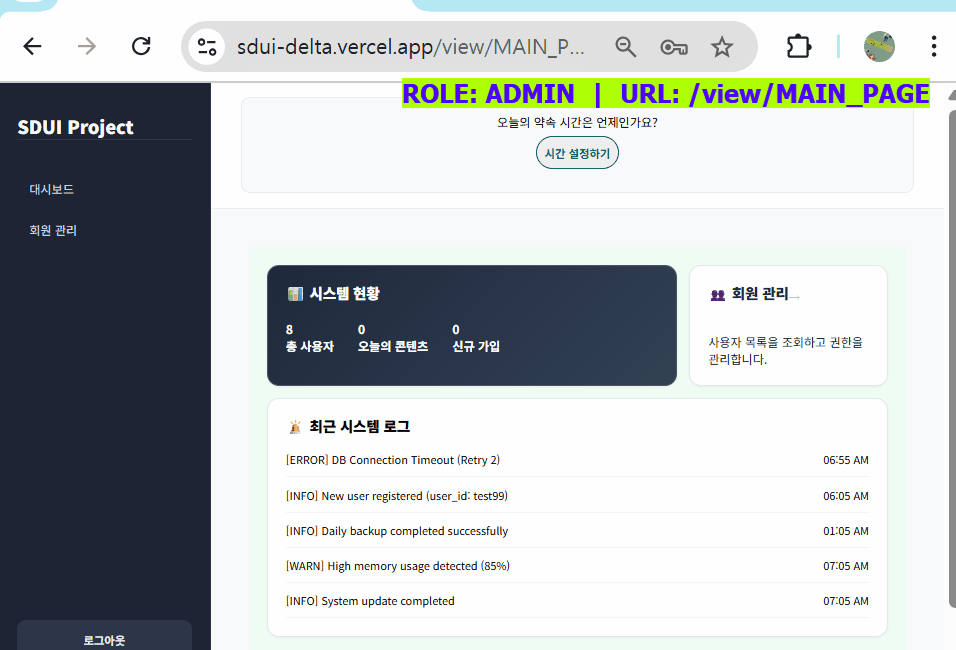
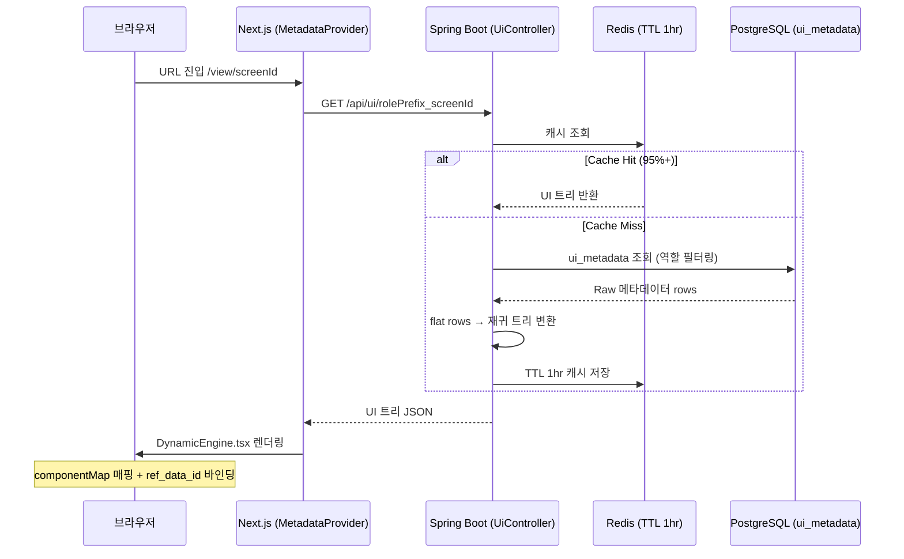

<div align="center">

# SDUI (Server-Driven UI) Engine

**"DB 한 줄로 화면이 바뀐다 — 클라이언트 배포 제로의 실시간 UI 아키텍처"**


<br/>

| 역할별 UI 전환 | DB 수정 → 즉시 반영 |
|:---:|:---:|
|  |  |
| GUEST → USER 전환 시 같은 URL, 완전히 다른 UI | DB row 1줄 수정 → 배포 없이 즉시 화면 반영 |

<br/>

| ⚡ UI 변경 배포 시간 | 🔄 컴포넌트 재사용률 | 🗄️ Redis 캐시 | 🔐 인증 방식 | 🤖 AI 기능 | 📱 PWA |
|:---:|:---:|:---:|:---:|:---:|:---:|
| **0분** | **80%+** | **TTL 1hr** | **JWT + OAuth2(Kakao) + RBAC** | **GPT-4o** | **지원** |

<br/>

[](https://sdui-delta.vercel.app)

</div>

---

## 🚀 왜 SDUI인가? (Problem → Solution)

### 기존 방식의 한계

```
기획팀: "버튼 이름 하나만 바꿔주세요."

[ 기존 개발 프로세스 ]

기획 변경 요청
    ↓
개발자 코드 수정 (~30분)
    ↓
PR 생성 → 코드 리뷰 (~수 시간)
    ↓
CI/CD 빌드 · 테스트 (~10분)
    ↓
운영 서버 배포 (~20분)
    ↓
화면 반영 완료

총 소요: 수 시간 ~ 하루
개발자 컨텍스트 스위칭 발생
```

### SDUI가 만드는 차이

```
기획팀: "버튼 이름 하나만 바꿔주세요."

[ SDUI 프로세스 ]

DB ui_metadata 한 row 수정 (label_text 변경)
    ↓
브라우저 새로고침
    ↓
화면 반영 완료

총 소요: 30초
비개발자도 가능
코드 수정 0줄 · PR 0건 · 배포 0회
```

---

## 📌 프로젝트 개요

SDUI는 반복되는 프론트엔드 UI 수정과 하드코딩 배포 프로세스의 비효율을 해결하기 위해 기획된 **서버 중심 메타데이터 렌더링 엔진**입니다.

UI의 구조(Component, Layout, Action)와 비즈니스 로직을 데이터베이스(`ui_metadata`)로 추상화하여, **단순 화면 변경 시 클라이언트 배포 없이 서버 설정만으로 즉각적인 런타임 업데이트가 가능**하도록 구현했습니다.

이 엔진 위에 **목표 시간 관리, AI 언어 학습, AI 면접 코칭, 카카오톡 자동 알림** 등의 실서비스 기능을 레이어링하여, SDUI 아키텍처의 유연성을 실제 비즈니스 요구사항으로 검증했습니다.

---

## 🏗 시스템 아키텍처 (Architecture & Data Flow)

### 🔄 핵심 렌더링 파이프라인

메타데이터 로딩 파이프라인에서 발생하는 RDBMS 부하를 막기 위해 **Redis 캐싱 계층**을 두어 Cache Hit 비율을 극대화했습니다.



### 핵심 파일 구조

```
metadata-project/
├── app/view/[...slug]/page.tsx       # 단일 CommonPage — 모든 화면 처리
├── components/
│   ├── DynamicEngine/
│   │   ├── DynamicEngine.tsx         # 메타데이터 트리 순회 & 렌더링 코어
│   │   ├── useDynamicEngine.tsx      # 데이터 바인딩 (formData > rowData > pageData)
│   │   └── hook/usePageHook.tsx      # 액션 라우터 (useUserActions | useBusinessActions)
│   ├── constants/
│   │   ├── componentMap.tsx          # component_type → React 컴포넌트 매핑 테이블
│   │   └── screenMap.ts              # URL path → screenId 매핑
│   └── fields/                       # 렌더링 가능한 모든 컴포넌트 (20+)
│       ├── AIChatComponent.tsx       # AI 언어 채팅 (V1)
│       ├── AIChatComponentV2.tsx     # AI 언어 채팅 V2 (음성 입력 지원)
│       ├── AIInterviewComponent.tsx  # AI 면접 코칭
│       ├── RecordTimeComponent.tsx   # 목표 시간 위젯
│       └── ...

SDUI-server/
└── src/main/java/com/domain/demo_backend/
    ├── domain/
    │   ├── ui/       # UiController → UiService (flat DB → 재귀 트리)
    │   ├── kakao/    # OAuth2, 카카오톡 알림 스케줄러
    │   ├── ai/       # OpenAI GPT-4o 채팅·면접 API
    │   ├── time/     # 목표 시간 설정 · 도착 기록
    │   ├── membership/ # 멤버십 조회 · 부여
    │   └── user/     # 인증·인가 (JWT, 이메일 인증)
    └── global/
        ├── security/ # Spring Security, JwtAuthenticationFilter
        └── config/   # Redis, CORS, WebSocket
```

---

## ✨ 주요 기능

### 1. SDUI 렌더링 엔진
- `ui_metadata` DB 테이블 한 row = 화면 컴포넌트 하나
- `component_type` → React 컴포넌트 자동 매핑 (20+ 컴포넌트)
- `ref_data_id` 기반 데이터 바인딩 (서버 데이터 ↔ UI 느슨한 결합)
- 재귀적 Repeater 패턴으로 리스트 UI 무한 확장
- Redis TTL 1hr 캐싱으로 RDBMS 부하 최소화

### 2. RBAC (역할 기반 접근 제어)
- GUEST / USER / ADMIN / PREMIUM 역할별 메타데이터 분기
- 같은 URL에서 역할에 따라 완전히 다른 화면 렌더링
- JWT + Spring Security 조합으로 API 레벨 보호

### 3. AI 언어 학습 채팅
- **영어 / 일본어 / 한국어** 3개 언어 AI 대화 상대
- GPT-4o 기반 실시간 스트리밍 응답
- 음성 녹음 입력 지원 (AudioRecorder + Waveform 시각화)
- PREMIUM 멤버십 전용 기능

### 4. AI 면접 코칭
- 직무·기술 스택 맞춤 AI 면접관 시뮬레이션
- 이력서 정보 기반 질문 생성 (`interview_resume` 테이블)
- 답변 평가 및 피드백 제공

### 5. 목표 시간 관리 + 카카오톡 자동 알림
- 약속 시간 설정 → 도착 기록 → 시간 통계
- 목표 달성 현황 및 메모를 벤토 그리드 위젯으로 표시
- **카카오 OAuth 토큰 기반** 약속 30분/90분/180분 전 자동 알림
- `@Scheduled` 1분 폴링 + `notif_sent_*min` 플래그로 중복 방지

### 6. 멤버십 시스템
- 회원가입 완료 시 PREMIUM 자동 부여 (구독 플로우 대응 가능)
- 멤버십 등급별 기능 접근 제어 (AI 채팅 = PREMIUM 전용)
- 멤버십 스토어 화면 (`MEMBERSHIP_SHOP_PAGE`)

### 7. 관리자 대시보드
- 전체 회원 목록 조회 / 멤버십 관리 (`ADMIN_USER_TABLE`)
- 지도 기반 사용자 위치 현황 (`AdminMapView`)

### 8. PWA (Progressive Web App)
- 모바일 홈화면 설치 지원 (`next-pwa`)
- 오프라인 캐싱 전략 적용 (Service Worker)

---

## SDUI 핵심 컨셉: 메타데이터 → UI 렌더링

DB의 `ui_metadata` 테이블 한 row가 화면의 컴포넌트 하나가 됩니다.

| DB `ui_metadata` row | 렌더링 결과 |
|:---|:---|
| `component_type: INPUT` | 텍스트 입력 필드 |
| `component_type: BUTTON` + `action_type: LOGIN_SUBMIT` | 클릭 시 로그인 처리 버튼 |
| `component_type: TEXT` + `label_text: '안녕하세요'` | 정적 텍스트 |
| `component_type: AI_CHAT_V2` | 음성 입력 포함 AI 채팅 UI 전체 |
| `component_type: TIME_RECORD_WIDGET` | 목표 시간 + 메모 위젯 |
| `group_direction: ROW` | 자식 컴포넌트를 가로 배치 (flex-row) |
| `group_direction: COLUMN` + `ref_data_id: diaryList` | 배열 데이터를 세로로 반복 렌더링 (Repeater) |
| `allowed_roles: 'ROLE_USER'` | 로그인 사용자에게만 표시 |

---

## 제공 화면 (Screen Map)

| 경로 | screenId | 접근 권한 |
|------|----------|----------|
| `/` | `MAIN_PAGE` | 전체 (역할별 분기) |
| `/LOGIN_PAGE` | `LOGIN_PAGE` | GUEST |
| `/SET_TIME_PAGE` | `SET_TIME_PAGE` | USER |
| `/AI_ENGLISH_CHAT_PAGE` | `AI_ENGLISH_CHAT_PAGE` | PREMIUM |
| `/AI_JAPANESE_CHAT_PAGE` | `AI_JAPANESE_CHAT_PAGE` | PREMIUM |
| `/AI_KOREAN_CHAT_PAGE` | `AI_KOREAN_CHAT_PAGE` | PREMIUM |
| `/CONTENT_LIST` | `CONTENT_LIST` | USER |
| `/CONTENT_WRITE` | `CONTENT_WRITE` | USER |
| `/MEMBERSHIP_SHOP_PAGE` | `MEMBERSHIP_SHOP_PAGE` | USER |

---

## 핵심 기술 의사결정 (Tech Reasoning)

### ① 데이터·UI 느슨한 결합 (`ref_data_id` 바인딩)

클라이언트 렌더링 엔진(`DynamicEngine`)과 서버 비즈니스 데이터(`query_master`)를
`ref_data_id` 식별자 하나로 느슨하게 연결했습니다.

```
ui_metadata.ref_data_id = "diaryList"
    ↕ (바인딩)
query_master.sql_key = "diaryList"
    → SELECT * FROM diary WHERE user_id = :userId
```

이 구조 덕분에 SQL 변경 없이 레이아웃 변경이 가능하고,
`group_direction: ROW ↔ COLUMN` 수정 한 줄로 반응형 뷰를 즉시 전환할 수 있습니다.

### ② 리피터(Repeater) 패턴 — 재귀 렌더링 최적화

리스트/게시판처럼 동일 구조가 반복되는 UI는 DB에 모든 자식을 하드맵핑하지 않습니다.

```
ref_data_id가 배열 타입일 경우:
  단일 템플릿 그룹 1개 → 배열 요소 수만큼 동적 복제

  diaryList = [{id:1, title:"일기1"}, {id:2, title:"일기2"}, ...]
      ↓ DynamicEngine Repeater
  [일기 카드 컴포넌트] × N개 렌더링
```

DB row 수를 최소화하면서 무한 확장이 가능한 리스트 렌더링을 구현했습니다.

### ③ Action Handler 분리 — OCP(개방-폐쇄 원칙) 적용

`usePageHook`이 모든 컴포넌트 이벤트를 가로채어 두 핸들러로 라우팅합니다.

```
컴포넌트 클릭
    ↓
usePageHook (액션 라우터)
    ├── userActionTypes 목록 해당 → useUserActions
    │   (LOGIN_SUBMIT, LOGOUT, REGISTER_SUBMIT, VERIFY_CODE ...)
    └── 그 외 → useBusinessActions
        (DIARY_WRITE, CONTENT_LIST, APPOINTMENT_BOOK ...)
```

새 액션 추가 시 기존 핸들러 수정 없이 각 훅에 case만 추가하면 됩니다.

### ④ 카카오톡 알림 — DB 폴링 기반 비동기 알림

카카오 OAuth 액세스 토큰을 DB에 저장하고, Spring `@Scheduled`가 1분마다 폴링하여
알림 시점이 된 사용자에게 카카오톡 "나에게 보내기" API를 호출합니다.
`notif_sent_30min / 90min / 180min` 플래그로 중복 발송을 원천 차단합니다.

---

## 기술 스택 (Tech Stack)

### Frontend Engine (`metadata-project`)

| 분류 | 기술 |
|------|------|
| Core | Next.js 15 (App Router), React 19, TypeScript |
| 상태 관리 | Zustand, TanStack Query (React Query) |
| 스타일링 | CSS Modules, 커스텀 CSS |
| 테스트 | Jest + React Testing Library (Unit), Playwright (E2E) |
| PWA | next-pwa (Service Worker, 홈화면 설치) |

### Backend Service (`SDUI-server`)

| 분류 | 기술 |
|------|------|
| Core | Java 17, Spring Boot 3.x |
| 인증/인가 | Spring Security, JWT, OAuth 2.0 (Kakao) |
| 데이터 | PostgreSQL, Flyway (마이그레이션 V1~V27) |
| 캐시 | Redis (UI 트리 캐시 + SQL 쿼리 캐시, TTL 전략) |
| AI | OpenAI GPT-4o (채팅 스트리밍, 면접 시뮬레이션) |
| 알림 | 카카오톡 나에게 보내기 API + @Scheduled 폴링 |

### Infra & DevOps

| 분류 | 기술 |
|------|------|
| 프론트엔드 배포 | Vercel (자동 CI/CD) |
| 백엔드 배포 | AWS EC2 + GitHub Actions |
| 로컬 인프라 | Docker Compose (PostgreSQL + Redis) |

---

## DB 엔티티 설계

### `ui_metadata` 핵심 구조

| 컬럼 | 역할 |
|------|------|
| `screen_id` | 화면 단위 식별 키 (예: `MAIN_PAGE`, `AI_ENGLISH_CHAT_PAGE`) |
| `component_type` | React 컴포넌트 1:1 매핑 (`INPUT`, `BUTTON`, `AI_CHAT_V2` 등) |
| `group_id` / `parent_group_id` | 부모-자식 컴포넌트 트리 계층 구조 형성 |
| `ref_data_id` | `query_master`의 데이터와 느슨한 바인딩 연결고리 |
| `action_type` | 클릭 이벤트 핸들러 라우팅 키 (`LOGIN_SUBMIT`, `APPOINTMENT_BOOK` 등) |
| `group_direction` | `ROW` → flex-row / `COLUMN` → flex-col / 벤토 그리드 지원 |
| `allowed_roles` | RBAC 역할 필터링 (`ROLE_USER`, `ROLE_GUEST`, NULL=전체) |
| `css_class` | 런타임 CSS 클래스 주입 (배포 없이 스타일 변경) |

### `query_master` 핵심 구조

| 컬럼 | 역할 |
|------|------|
| `sql_key` | `ref_data_id`와 매핑되는 식별 키 |
| `sql_query` | 실행할 SQL (`:userId` 등 바인딩 파라미터 포함) |
| Redis 캐시 | `SQL:{sqlKey}` 키로 TTL 적용 캐싱 |

---

## SDUI가 만드는 차이: 역할별 UI 전환 (RBAC + SDUI)

같은 URL, 같은 프론트엔드 코드 — DB 메타데이터만 다를 때 화면이 달라집니다.

| GUEST (비로그인) | USER (로그인) |
|:---:|:---:|
|  |  |
| 공개 컴포넌트만 렌더링 | 개인화된 컴포넌트 + 기능 활성화 |

> `MetadataProvider`는 React Query 키를 `${rolePrefix}_${screenId}` 형식으로 구성합니다.
> 백엔드는 이 키를 기반으로 역할에 맞는 메타데이터만 필터링하여 반환합니다.

---

## AI-Assisted Development Workflow

본 프로젝트는 **1인 풀스택 설계·구현·배포** 환경에서, 코어 아키텍처는 직접 설계하되
반복 작업과 디버깅은 AI(Claude Code) 서브에이전트에게 위임하는 하이브리드 워크플로우를 채택했습니다.

### 직접 설계·통제한 영역 (Human)

- **아키텍처 설계**: `ui_metadata` 스키마, `ref_data_id` 바인딩 전략, Redis TTL 캐싱 정책
- **코어 로직**: `DynamicEngine` 재귀 트리 렌더링, Spring Security 인증/인가 파이프라인
- **기능 기획**: AI 채팅·면접 UX, 카카오 알림 타이밍 전략, 멤버십 등급 설계
- **최종 검수**: AI 작성 코드가 OCP·단일 책임 원칙에 부합하는지 리뷰 후 병합

### AI에게 위임한 영역 (Claude Code Agent)

- **보일러플레이트 생성**: `componentMap` 기반 다량의 폼 컴포넌트 반복 코드
- **Flyway 마이그레이션 SQL**: 스키마 변경 사항의 SQL 작성 및 체크섬 관리
- **트러블슈팅**: Vercel CSP 오류, DOM Props 충돌, React Query 캐시 불일치 등 파편화 이슈 분석

> *"AI는 코드를 짜주지 않습니다. 명확한 아키텍처와 도메인 규칙을 주입했을 때, 비로소 강력한 서브엔지니어 도구로 동작합니다."*

---

## 로컬 실행 방법 (Getting Started)

### 사전 요구사항

- Docker Desktop
- Java 17+
- Node.js 18+

### 1. 인프라 실행 (PostgreSQL + Redis)

```bash
docker-compose up -d
```

### 2. 백엔드 실행

```bash
cd SDUI-server
./gradlew bootRun
```

Flyway가 V1~V27 마이그레이션을 자동 적용합니다.

### 3. 프론트엔드 실행

```bash
cd metadata-project
npm install
npm run dev
```

브라우저에서 `http://localhost:3000` 접속

---

<div align="center">

**Developed by Min Yerin**
*1인 풀스택 설계 · 구현 · 배포 (2026)*

[](https://github.com/feed-mina)
[](mailto:myelin24@naver.com)

</div>
